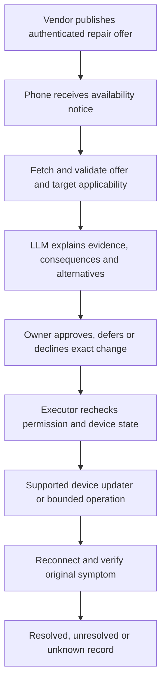

# Owner-approved device repair

An AI-assisted repair service can connect a device owner, a manufacturer, and a supported device so that an available fix becomes an understandable, approved, measured transaction. The near-term opportunity is reducing the work between discovering a known fault and confirming its resolution. It is not universal remote control, instant firmware repair, or proof that an LLM can safely invent patches for closed devices.

This assessment uses official technical documentation and the retained two-Moto diagnostics experiment. External products were researched, not benchmarked. Proposed architecture, test thresholds, and sequencing below are recommendations, not implemented features. Research checked 10 September 2026; protocol revisions and device compatibility must be pinned when an adapter is implemented.

## 1. What the phone can contribute

For slow internet, the phone can be both the user's interface and a measurement point on the affected network. It can ask for a description, collect bounded measurements, compare possible causes, present a proposed action, and measure again. Being on the same Wi-Fi does not give it administrative authority over a router, appliance, or other phone.

Android exposes network state and capabilities through ConnectivityManager. A network being marked INTERNET is different from a successful validation probe, and even VALIDATED does not establish that every destination works. A VPN or cellular fallback can also make a test appear successful while the intended Wi-Fi path is still broken. Tests must record the actual selected network and transport. [^1]

Ordinary apps must not assume access to all system diagnostics. ConnectivityDiagnosticsManager restricts callback delivery to qualifying network-providing apps such as active VPNs, carriers and Wi-Fi suggesters. An app can register incorrectly and receive no callbacks; no observations must not be reported as healthy. [^2]

### Proposed diagnostic ladder

| Question | Evidence to collect | Interpretation limit |
|---|---|---|
| Is this phone on the intended network? | Transport, network identifier held locally, validation/captive-portal state, time | Association alone is not internet access. |
| Is the local path functioning? | Small requests to an authorized local endpoint; supported router telemetry | A missing ICMP response alone does not prove a dead router. |
| Is name resolution failing? | Timed resolution of controlled names on the selected network; compare connection outcomes | A single hostname failure may be service-specific. |
| Is the upstream path impaired? | Bounded HTTPS probes to more than one controlled/known endpoint; optional router WAN status | One remote service cannot represent the entire internet. |
| Is this location or phone the problem? | Repeat at a specified second location or compare a second device | Different radios and paths make comparisons imperfect. |
| Is throughput low or latency rising under load? | Explicitly authorized byte/time-capped test, idle and loaded latency | A speed test creates load and can affect other users; it is not a continuous default. |
| Did the repair resolve the original problem? | Repeat the same measurements on the same intended path, plus user symptom check | A successful settings change is not a successful repair. |

This ladder is a proposed diagnostic design, not a report of measurements already taken on the household network. Persistent ISP congestion, physical interference, damaged cabling, or a service outage may require placement changes, a technician, or the provider. The app should produce a useful support packet when it cannot repair the cause.

### What changing something requires

Own-app configuration can use an owned implementation. Router changes need an authenticated, supported management interface with appropriate scope. OpenWrt's rpcd/ubus system is one example with access controls; it is not a reason to install OpenWrt on a household router or expose its administration port publicly. [^3]

Android also restricts ordinary applications from enabling/disabling Wi-Fi through setWifiEnabled on current target levels; documented management exceptions are not permissions our installed companion automatically has. A supported settings interaction may be necessary. We should not claim that a generic voice command can silently perform every network reset. [^4]

## 2. Existing systems and the real opportunity

| Existing system | Documented overlap | Implication |
|---|---|---|
| RouteThis Resolve | Subscriber phones/tablets provide network diagnostics, guided support and fix verification. [^5] | Phone-based diagnosis and verified support are already a product category. |
| Broadband Forum USP/TR-369 | An Agent–Controller protocol for supported device management with authorization/security mechanisms. [^6] | Use a supported management protocol when available; do not invent an incompatible universal router protocol. |
| Home Assistant Repairs | Integrations publish issues and can provide confirmation-driven repair flows. [^7] | A persistent issue plus an actionable repair is established practice. |
| Mender | Device-integrated software deployment, with update and recovery mechanisms. [^8] | Reuse a suitable update engine; compatibility and recovery depend on its integration with the device. |
| Memfault/Nordic mobile gateway | A documented Bluetooth workflow checks, downloads and starts firmware updates through a phone and observes device information afterward. [^9] | A company delivering firmware through a phone is not new by itself. |
| TUF and IETF SUIT architecture | Existing designs for authenticated update distribution and firmware manifests. [^10][^11] | Build on established trust machinery rather than treating a custom signature field as a complete updater. |

These are vendor/protocol claims checked in primary documentation, not independently reproduced competitor results. This review does not establish patent novelty or that competitors lack every proposed control.

The plausible product target is **owner-controlled repair across explicitly supported devices**: one understandable inbox, a concrete explanation, minimal requested authority, an interruption-aware executor, and evidence about the original symptom. This can be valuable without inventing every underlying mechanism. The advantage has to be measured in fewer user steps, successful resolutions, and fewer unsafe or duplicated actions.

## 3. Company-to-device flow

The proposed flow separates a notification, an authentic repair offer, permission, execution, and the resulting effect:

**Notification.** A push message is a hint that a repair may exist. It must not contain an unrestricted executable command or count as permission. The app fetches the current offer through the authenticated channel. Firebase documents normal-priority delays during Doze and limited processing time even for high-priority delivery, so push cannot support a blanket instant-delivery guarantee. [^12]

**Company identity.** A logo, email address, model endorsement, HTTPS download or same-LAN discovery is insufficient on its own. The platform needs an enrollment process for publishers and an update trust root accepted for that product. Pairing our phone to our backend is a different relationship from trusting a manufacturer to publish firmware for a router. A phone-to-backend credential must not be reused as manufacturer signing authority.

**Applicability.** A verified offer must identify the eligible product/hardware revisions, component, current-version constraints, target version, payload identity, and relevant dependencies. Our proposal adds the observed fault reference, permitted operation, effect check and recovery policy. RFC 9124 supplies an existing information model including vendor/class identity, precursor conditions, sequences, payload digests and dependencies; these fields should inform interoperability work rather than be presented as our invention. [^13]

**Owner choice.** The approval screen should show the exact device, what changes, expected interruption, data affected, and whether rollback is available. The owner may decline or defer. Notification enrollment is not permission to install, and a remembered preference must not silently become automatic update authorization. The LLM may explain why a fix appears relevant, but cannot override the owner or certify an unknown binary as safe.

**Execution.** Approval binds the operation, device identity, payload/configuration digest, applicable starting state and expiry. Immediately before acting, the executor checks these again. A different download, changed device state, revoked authority or substituted target invalidates the old approval. The phone can be an approval console, a BLE/local relay, or the actual app being updated; these are different deployment roles with different failure modes.

**Verification.** Record availability, receipt, approval, installation, reboot and symptom verification separately. For example, a router can report the new firmware while DNS failures persist. That transaction is installed-but-unresolved, not fixed. A missing response after a network-affecting action is unknown until reconciliation establishes the state.

## 4. The model's useful role and its limits

The LLM can translate a support bulletin, explain an error, summarize measurements, compare a proposed change against the owner's preferences, and request one registered operation. A deterministic verifier checks signatures, target binding, state constraints, expiry and permissions. The model should not inspect a binary and pronounce it trustworthy or execute instructions from an untrusted release note.

The local skill library can teach a procedure, list source manuals and reference registered operations. It should be read only after its provenance and compatibility checks pass. A signed skill is still content that may be wrong; its author cannot grant new device authority by naming a tool. Executable adapters and update payloads need separate release controls from descriptive Markdown.

Security advisories can be ingested in a structured format such as OASIS CSAF. An advisory can help match a product/version to an issue, but is not an executable fix or evidence that this particular symptom has that cause. [^14]

A company could offer a remote configuration correction without generating new firmware. Where code changes really are required, the normal path is source repair, build, tests, publisher signing and controlled release. LLM-generated patches belong upstream in that engineering process. Sending an improvised patch directly into an owner's closed appliance is not the proposed product.

## 5. Recovery is device-specific

TUF authenticates update discovery and downloaded artifacts and addresses important repository/key-compromise threats. It does not install the artifact or establish that its behavior repairs a fault. The integration still needs an installer and postcondition checks. [^10]

Android A/B updates illustrate why recovery belongs in the actual device implementation: alternate slots can retain a bootable fallback, with boot verification before marking success. That design cannot be inferred for an arbitrary router, appliance or even the two Motos without checking their shipped update path. [^15]

Android device-management APIs have specific roles and conditions for system update installation and policy. An ordinary sideloaded companion must not claim those roles, bypass OEM verification, unlock a bootloader, or imply it can universally downgrade firmware. [^16]

For a network-changing operation, preserve intent before changing the connection. The executor should have a device-local safety mechanism, such as a vendor-supported confirmed commit or demonstrated rollback timer, when loss of access is foreseeable. The phone may keep a control channel over cellular only where available and explicitly tested; that does not repair the Wi-Fi path or make the affected appliance internet-connected.

Never blindly repeat a firmware install, reboot, or configuration mutation after timeout. Read back by the same transaction identity where the vendor supports it. If the vendor offers no reliable reconciliation, show unknown and require a defined recovery procedure. Cancellation before execution and interruption during a flash are not equivalent; promising an always-working cancel button would be misleading.

## 6. Minimum repair offer for a prototype

The following is a design checklist, not a shipped schema or assertion of compliance with a standard:

| Group | Required information |
|---|---|
| Publisher | Trusted publisher reference, product scope, signature metadata and revocation/freshness status |
| Target | Bound device reference, hardware/component identity, exact applicable starting state |
| Change | Registered operation, artifact/configuration digest, size, target version, dependencies |
| Reason | Vendor issue reference and linked local observations; separate assertions from measurements |
| Approval | Owner, approved digest, expiry, permitted timing, disclosed interruption and data effects |
| Recovery | Device-supported recovery method, interruption classification, reconciliation query |
| Verification | Named original-symptom checks, comparison window, expected result and evidence format |

Prefer existing vendor updaters and compatible TUF/SUIT-informed verification at the appropriate boundary. A generic app must never claim it can replace an OEM's trusted updater simply because it can download an APK or send Bluetooth packets.

## 7. What the current project actually establishes

The retained experiment shows two Motos receiving real GPT-5.6 Sol proposals for one fixed operation, owner-authorized A1 approval through the actual web flow, diagnostics becoming enabled, and the preference/result surviving process restart. Fresh battery readback matched the app report; observer verification was recorded separately. It does not establish a network diagnostic engine, company enrollment, signed external update delivery, arbitrary device control or firmware recovery. [^17]

The source compiler still allows only `enable_companion_diagnostics` or no action. Its narrowness is deliberate. The new diagnostics SKILL.md documents the known procedure and exact tested artifact; it explicitly has no runtime loader or automatic version gate. [^18]

The useful reusable pieces are request identity, fixed proposal compilation, approval binding, device execution checks and retained result records. Their behavior must be retested for every new adapter; the prior diagnostics result does not transfer to network fixes. Status-refresh and camera-notes integration remain separate existing work, not hidden prerequisites already completed by this research.

## 8. Finite validation sequence

Complete the existing status-refresh and camera-notes device acceptance first. The following research-derived sequence is the next lane, not an instruction to change the home network now.

1. **Read-only network report on a Moto.** One explicit Check connection action; bounded probes; show selected path and what could/could not be concluded. No router writes, traffic interception, settings changes or background speed-test loop.
2. **One owned repair offer.** Publish a signed offer for a harmless owned app configuration. Deliver the notification, display the exact change, approve, execute, verify and reopen. This tests the company-offer concept without claiming an independent manufacturer's endorsement.
3. **One spare supported router.** Choose the router model/firmware and documented management interface first. Use a separate test network and one reversible configuration fault. Do not start with a household WAN, Wi-Fi password change, firmware flash, or factory reset.
4. **One real manufacturer integration.** Obtain its supported API/update path, publisher trust material and supported recovery procedure. Only then attempt a vendor-supplied update on designated test equipment.

### Required acceptance cases

| Case | Required observed result |
|---|---|
| Valid offer and approval | Exact allowed effect, fresh postcondition, persistent record |
| Declined or expired approval | Zero observed mutation in the instrumented interval |
| Wrong device, hardware or starting version | Refusal before the updater/operation entry point |
| Tampered payload or substituted artifact | Refusal; original approval cannot authorize replacement |
| Duplicate/out-of-order notification | Same offer/transaction reconciled, no automatic repeated effect |
| Network loss after execution begins | Persisted unknown or supported recovery; no blind replay |
| Process restart before approval and after completion | Accurate recovered phase and no invented success |
| Vendor revocation before execution | Refuse when fresh revocation is required; disconnected state is explicit |
| Hostile text in release notes | Text cannot expand operations, credentials or permissions |
| Update installed but original fault remains | Installed status retained, repair unresolved |

Proposed first-lane limits: at most one 60-second diagnostic session per explicit request and at most 1 MB of payload probes, excluding transport overhead. Any throughput test is separately requested and capped. These are starting test budgets, not measured performance. Measure notification delay, diagnosis time, owner interactions, execution time, reconnect time, verified outcomes and unknown outcomes separately. Report sample counts and repeated-run results; one passing run cannot establish reliability at scale.

## 9. What “almost instant” can honestly mean

The strongest initial promise is a short path from a known, applicable fix to an owner decision, followed by measured execution. A small local configuration repair may be quick. Firmware transfer, reboot, safety checks, unavailable connectivity, human approval and a manufacturer release process introduce real delay. Some failures require physical work and cannot be repaired by software.

The right product question is therefore: can a supported customer resolve a known issue with fewer steps, less authority granted, and clearer proof than the existing vendor support flow? Test that head-to-head with the same failure and recovery scenario. Do not use a generic “faster than Siri” or “first universal repair platform” claim as a substitute.

The immediate commercial hypothesis is an integration product for manufacturers or support providers plus an owner-facing repair inbox. Company onboarding, sustained adapter maintenance, telemetry consent and responsibility for bad updates are substantial work. The model is a replaceable interpreter; the supported connections and trustworthy transaction are the durable product.

## Sources

Official sources below were accessed 10 September 2026. Undated live documentation is listed without an invented publication date. Product documentation establishes documented capability, not independently measured performance.

[^1]: Android Developers. [Read network state](https://developer.android.com/develop/connectivity/network-ops/reading-network-state).
[^2]: Android Developers. [ConnectivityDiagnosticsManager](https://developer.android.com/reference/android/net/ConnectivityDiagnosticsManager).
[^3]: OpenWrt. [ubus](https://openwrt.org/docs/techref/ubus).
[^4]: Android Developers. [WifiManager](https://developer.android.com/reference/android/net/wifi/WifiManager).
[^5]: RouteThis. [Resolve](https://www.routethis.com/isps/resolve).
[^6]: Broadband Forum. [TR-369 User Services Platform specification](https://usp.technology/specification/index.htm). Pin the applicable revision during implementation.
[^7]: Home Assistant. [Repairs developer documentation](https://developers.home-assistant.io/docs/core/platform/repairs/).
[^8]: Mender. [Introduction](https://docs.mender.io/overview/introduction).
[^9]: Memfault. [Nordic Bluetooth Quickstart](https://docs.memfault.com/docs/mcu/quickstart-bluetooth).
[^10]: The Update Framework. [Overview](https://theupdateframework.io/docs/overview/), page revision October 2024.
[^11]: IETF, Moran et al. [RFC 9019: A Firmware Update Architecture for Internet of Things](https://www.rfc-editor.org/info/rfc9019/), April 2021; informational RFC.
[^12]: Firebase. [Set and manage Android message priority](https://firebase.google.com/docs/cloud-messaging/android-message-priority).
[^13]: IETF, Moran et al. [RFC 9124: A Manifest Information Model for Firmware Updates](https://www.rfc-editor.org/rfc/rfc9124.html), January 2022; informational RFC.
[^14]: OASIS. [Common Security Advisory Framework v2.0, Errata 01](https://docs.oasis-open.org/csaf/csaf/v2.0/csaf-v2.0.html).
[^15]: Android Open Source Project. [A/B seamless system updates](https://source.android.com/docs/core/ota/ab), page revision June 2026.
[^16]: Android Developers. [Manage system updates](https://developer.android.com/work/dpc/system-updates) and [DevicePolicyManager](https://developer.android.com/reference/android/app/admin/DevicePolicyManager).
[^17]: Project evidence. [Two-phone supervised repair](../evidence/frontier-repair-20260910/README.md), 10 September 2026. Captured records, not an external certification.
[^18]: Project implementation. [Fixed model-proposal compiler](../../src/mobile-assistance.js) and [diagnostics skill](../../phone-skills/companion-diagnostics/SKILL.md).

## Follow-up: qualifications to the model-comparison table

The comparison does not establish that every existing consent holder is a vendor, ISP or employer, or that an owner-held cross-vendor broker is absent from the market. That remains a product hypothesis requiring direct competitor evaluation, not a conclusion from model agreement.

Matter provides a relevant consent mechanism, but its scope matters. The connectedhomeip Linux requestor example documents granted/denied/deferred and RequestorCanConsent. Its userConsentState option applies when UserConsentNeeded is true, to the first download attempt; subsequent queries use granted in this test application. It therefore must not be copied as a durable owner-approval boundary. It is not evidence that an arbitrary phone app can veto every commercial device update. Download consent, apply authorization and OEM signature validation are distinct. Source: [Matter requestor reference](https://github.com/project-chip/connectedhomeip/blob/master/examples/ota-requestor-app/linux/README.md). The [Matter 1.1 core specification](https://csa-iot.org/wp-content/uploads/2023/05/22-27349-002_matter-1-1-core-specification.pdf) documents user consent, but this historical version is not a substitute for validating a selected device's implementation.

The blanket claim that ICMP requires a custom JNI/C++ layer is too strong. Android's Java InetAddress documentation describes ICMP followed by TCP echo fallback. Neither a false return nor silent intermediate router establishes a fault. Actual permission, executable availability and traceroute behavior remain device-specific; the first diagnostic need not include traceroute. Source: [Android InetAddress](https://developer.android.com/reference/java/net/InetAddress).

SystemUpdatePolicy documentation confirms that setting a management policy suppresses normal system update notifications. It also documents exceptions for some manufacturer/carrier security updates. A managed consent product must implement and test its own notification path without pretending to veto those exceptions. No such policy was set during this research. Source: [SystemUpdatePolicy](https://developer.android.com/reference/android/app/admin/SystemUpdatePolicy).

CSAF is useful for an offline advisory-reading test, but the broad assertion that BSI mandates CSAF for everyone is not supported by the material checked. BSI's manufacturer FAQ recommends CSAF. Any mandatory requirement needs its specific jurisdiction, contract or certification scope. Source: [BSI manufacturer FAQ](https://www.bsi.bund.de/DE/IT-Sicherheitsvorfall/IT-Schwachstellen/FAQ_Hersteller/FAQ_Hersteller_node.html).

SHA256SUMS and completion receipts do not establish SLSA provenance or a SLSA level. Build provenance describes the builder, process and inputs linked to output artifacts. A future build-attestation implementation must generate and verify that evidence; relabeling the current receipts is insufficient. Source: [SLSA provenance v1.1](https://slsa.dev/spec/v1.1/provenance).

A/B recovery means firmware is not universally unrollable, while anti-rollback and hardware constraints mean recovery cannot be promised universally either. The actual updater decides. Likewise, cellular is an optional alternate control path, not proof that Wi-Fi recovered. Local diagnostics must remain useful without a cloud model and explicitly mark missing measurements.

Sequence retained: close display refresh, camera notes, and PhoneClaw comparison before opening the network execution lane. An offline advisory reader can evaluate explanation quality without actuation, but it does not prove network diagnosis or update control. Do not expand the active implementation queue solely because another research option is available.
